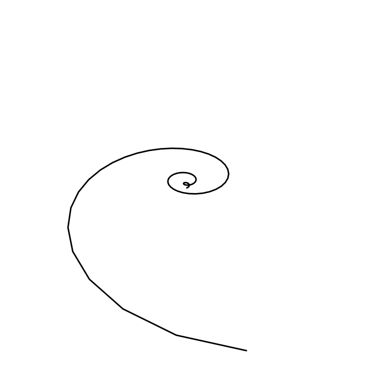

# plot3

<figcaption align="center">Log spiral plot</figcaption>

3D plots using [fogleman/ln](https://github.com/fogleman/ln) library with the hope of someday being incorporated into gonum's [plot library](https://github.com/gonum/plot).

## Examples
See [`plot_test.go`](./plot_test.go)

## Contributing
For the love of god help me